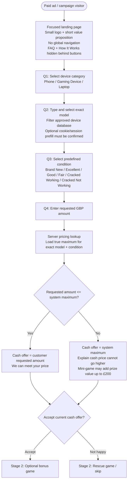
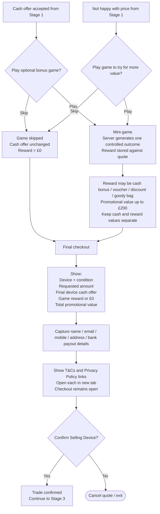
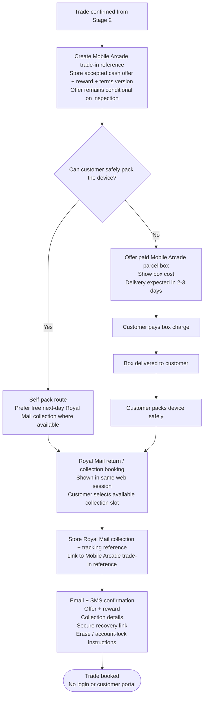
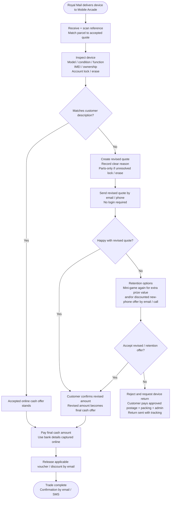

# Mobile Arcade Device Collection - UX Flow v3 (TRAE Implementation Specification)

> Machine-readable implementation specification derived from the approved Mobile Arcade UX flow and supporting landing-page requirements.
> Intended for use by AI coding assistants such as TRAE IDE.
> It contains explicit user flows, low-fidelity wireframes, form fields, decision branches, conversion goals, analytics requirements, and Mermaid diagrams so the implementation does not depend on visual PDF interpretation.

## 1. Purpose

Build a lightweight, high-conversion web journey for paid-ad visitors who want to sell a device to Mobile Arcade.

The customer journey covers:

1. Identify the device.
2. Establish the customer's requested cash amount.
3. Compare it with Mobile Arcade's system maximum.
4. Offer an optional or rescue mini-game.
5. Show a final cash + reward checkout summary.
6. Confirm the trade.
7. Arrange Royal Mail return / collection.
8. Receive and inspect the device.
9. Pay the accepted amount or issue a revised quote where required.

## 2. Global UX Rules

- The journey is designed primarily for visitors arriving from paid advertising.
- Keep the landing page focused and distraction-free.
- Show only:
  - a small Mobile Arcade logo;
  - a short value proposition;
  - the device-selling questions;
  - the primary actions required to progress.
- Do **not** show global site navigation in the paid-campaign journey.
- `FAQ` and `How it works` must be hidden behind buttons / expandable UI rather than displayed as competing page content.
- There is **no customer registration or login** in the MVP.
- There is **no Mobile Arcade customer status portal** in the MVP.
- Terms & Conditions and Privacy Policy are exposed as links at the final confirmation decision and must open in a **new browser tab**, leaving checkout open in the original tab.
- Email and SMS are used for confirmations, recovery links, preparation instructions, revised quotes, and completion messages.
- Royal Mail / carrier tracking is the parcel-tracking mechanism available to the customer.
- Mobile Arcade also issues its own trade-in reference ID.
- No photo or video upload is required in the MVP quote journey.
- The online offer remains conditional on the received device matching the customer's declared model and condition.

---


## 2A. AI Implementation Coverage Map

This specification deliberately covers the six areas that must be available to an AI coding assistant before implementation.

| Required area | Where it is defined |
|---|---|
| User flow | Stages 1-4 and Mermaid diagrams |
| Wireframe / mockup | Section 2B - Low-Fidelity Screen Wireframes |
| Form fields | Section 2C - Form Field Specification |
| Decision branches | Stage-specific Mermaid diagrams and Section 2D - Decision Branch Index |
| Final conversion goal | Section 2E - Conversion Goal |
| Tracking requirements | Section 2F - Tracking and Analytics Requirements |

TRAE should treat these sections together as the implementation baseline. The Mermaid flows define navigation and branching; the wireframes define screen intent; the form-field table defines inputs and validation; the tracking section defines analytics and logistics identifiers.

## 2B. Low-Fidelity Screen Wireframes / Mockups

These are **structural wireframes**, not final visual designs. They show the hierarchy, content order, and primary actions TRAE should implement. The paid-ad journey must remain visually focused and free from competing navigation.

### Screen 1 - Landing / Quote Questions

```text
+--------------------------------------------------+
|                MOBILE ARCADE LOGO                |
|                                                  |
|        Sell your device. Get a quick offer.      |
|                                                  |
|  1. Which category are you selling?              |
|     [ Phone ] [ Gaming Device ] [ Laptop ]       |
|                                                  |
|  2. Which model are you selling?                 |
|     [ Start typing model...................... ] |
|     [ filtered database suggestions ]            |
|                                                  |
|  3. What condition is it in?                     |
|     [ Brand New ] [ Excellent ] [ Good ]         |
|     [ Fair ] [ Cracked Working ]                 |
|     [ Cracked Not Working ]                      |
|                                                  |
|  4. How much money do you want?                  |
|     [ £____________ ]                            |
|                                                  |
|              [ GET MY OFFER ]                    |
|                                                  |
|       [How it works]          [FAQ]              |
+--------------------------------------------------+
```

Requirements:
- No global navigation.
- FAQ and How It Works remain hidden until opened.
- A small logo, short value proposition, and the quote questions dominate the screen.
- If prior cookie/session data suggests a model, prefill only as a convenience and require user confirmation.

### Screen 2 - Offer / Price Decision

```text
+--------------------------------------------------+
|                   YOUR OFFER                     |
|                                                  |
|   Device: [model]                                |
|   Condition: [condition]                         |
|                                                  |
|              CASH OFFER                          |
|                 £[amount]                        |
|                                                  |
|  Conditional on the device matching what you    |
|  told us.                                        |
|                                                  |
|  [ ACCEPT OFFER ]      [ NOT HAPPY WITH PRICE ] |
+--------------------------------------------------+
```

If the requested amount is above the system maximum, this screen must clearly explain that the displayed cash amount is Mobile Arcade's true system maximum and that the user may play the mini-game for additional promotional value.

### Screen 3 - Mini-Game / Skip

```text
+--------------------------------------------------+
|                BONUS MINI-GAME                   |
|                                                  |
|        Win extra prizes worth up to £200         |
|                                                  |
|              [ GAME / WHEEL ]                    |
|                                                  |
|              [ PLAY NOW ]                        |
|                                                  |
|              [ SKIP GAME ]                       |
+--------------------------------------------------+
```

Requirements:
- The game is optional after an accepted offer.
- The game is a conversion-rescue option after a rejected/not-happy offer.
- Skipping must always continue naturally to final checkout unless the user explicitly cancels the quote.
- Reward outcome is generated server-side and stored against the trade/quote.

### Screen 4 - Final Checkout / Confirm Selling Device

```text
+--------------------------------------------------+
|               FINAL TRADE SUMMARY                |
|                                                  |
|  Device:                     [model]              |
|  Condition:                  [condition]          |
|  You asked for:              £[requested]         |
|  Device cash offer:          £[cash]              |
|  Game reward / prize:        [reward or £0]       |
|                                                  |
|  Contact & payout details                        |
|  Name        [_______________________________]   |
|  Email       [_______________________________]   |
|  Mobile      [_______________________________]   |
|  Address     [_______________________________]   |
|  Bank payout [_______________________________]   |
|                                                  |
|  [Terms & Conditions ↗]  [Privacy Policy ↗]      |
|                                                  |
|          [ CONFIRM SELLING DEVICE ]              |
|                [ Cancel quote ]                  |
+--------------------------------------------------+
```

Requirements:
- Cash value and promotional reward must be displayed separately.
- T&Cs and Privacy Policy open in a new tab so checkout remains open.
- Confirmation is the customer's commitment to the trade, subject to inspection.

### Screen 5 - Royal Mail Return / Collection

```text
+--------------------------------------------------+
|              TRADE-IN CONFIRMED                  |
|            Reference: MA-[reference]             |
|                                                  |
|  Can you safely pack the device yourself?        |
|                                                  |
|      [ YES - I CAN PACK IT ]                     |
|      [ NO - SEND ME A PARCEL BOX ]               |
|                                                  |
|  Self-pack:                                      |
|  [ ARRANGE FREE ROYAL MAIL RETURN / COLLECTION ] |
|                                                  |
|  Parcel-box route:                               |
|  Box price: £[amount]                            |
|  Expected delivery: 2-3 days                     |
|  [ ORDER BOX ]                                   |
+--------------------------------------------------+
```

Requirements:
- Where Royal Mail permits it, show booking in the same web session after trade confirmation.
- Email/SMS act as confirmation and recovery routes, not the only way to begin booking.
- Do not require a Mobile Arcade account or login.

### Screen 6 - Booking Confirmation

```text
+--------------------------------------------------+
|               COLLECTION BOOKED                  |
|                                                  |
|  Mobile Arcade ref:     MA-[reference]           |
|  Royal Mail ref:        [carrier reference]      |
|  Collection:            [date / slot]            |
|  Tracking:              [tracking reference]     |
|                                                  |
|  Next steps:                                     |
|  - Back up your device                           |
|  - Erase it                                      |
|  - Remove account / activation lock              |
|                                                  |
|  Confirmation sent by email and SMS.             |
+--------------------------------------------------+
```

---

## 2C. Form Field Specification

The following fields are required by the current UX flow. TRAE should use these as the canonical MVP form inputs unless a later approved BRD overrides them.

| Stage | Field | Suggested control | Required | Validation / behaviour |
|---|---|---|---|---|
| Quote | `device_category` | Radio / button group | Yes | Allowed: `phone`, `gaming_device`, `laptop` |
| Quote | `device_model_id` | Typeahead + filtered dropdown | Yes | Must resolve to an approved device-database record; cookie/session suggestion must be confirmed |
| Quote | `device_condition` | Radio / cards | Yes | Brand New, Excellent, Good, Fair, Cracked Working, Cracked Not Working |
| Quote | `requested_amount_gbp` | Currency / numeric input | Yes | Positive GBP amount; compared server-side with system maximum |
| Offer | `offer_action` | Buttons | Yes to progress | `accept` or `not_happy` |
| Game | `game_action` | Buttons | Yes to resolve branch | `play` or `skip`; skip must not block checkout |
| Checkout | `customer_name` | Text input | Yes | Non-empty |
| Checkout | `customer_email` | Email input | Yes | Valid email format; used for confirmations and rewards |
| Checkout | `customer_mobile` | Tel input | Yes | Valid UK-compatible phone format; used by SMS provider |
| Checkout | `collection_address` | Address fields / lookup | Yes | Required for collection / parcel-box delivery |
| Checkout | `bank_payout_details` | Secure payout fields | Yes before collection booking | Must not be logged in analytics; handle as sensitive data |
| Checkout | `terms_accepted` | Checkbox | Yes | T&Cs link opens new tab |
| Checkout | `privacy_policy_viewable` | Link | N/A | Privacy Policy opens new tab |
| Checkout | `confirm_trade` | Primary button | Yes | Creates accepted trade and Mobile Arcade reference |
| Fulfilment | `can_self_pack` | Yes / No | Yes | Determines direct booking vs paid parcel-box route |
| Parcel box | `parcel_box_order` | Purchase action | Conditional | Required only if customer cannot safely self-pack |
| Royal Mail | `collection_slot` | Carrier slot selector | Conditional / required for booked collection | Store selected slot and carrier booking reference |

### System-generated fields

The user does not type these, but they are required to implement the flow:

- `system_maximum_gbp`
- `cash_offer_gbp`
- `reward_type`
- `reward_value`
- `trade_reference_id`
- `offer_status`
- `terms_version`
- `royal_mail_booking_reference`
- `royal_mail_tracking_reference`
- UTM attribution fields
- customer/trade state

---

## 2D. Decision Branch Index

TRAE must implement each branch explicitly rather than inferring it from UI text.

| Decision | Yes / matching branch | No / alternative branch |
|---|---|---|
| Is the requested amount `<= system_maximum`? | Cash offer = requested amount | Cash offer = system maximum; explain cap and game opportunity |
| Does customer accept current cash offer? | Offer optional bonus game | Offer rescue game / skip route |
| Does customer play game? | Generate/store server-controlled reward | Reward = 0; continue to final checkout |
| Does customer confirm selling device? | Create trade-in reference and begin fulfilment | Cancel quote / exit |
| Can customer safely self-pack? | Proceed directly to Royal Mail return / collection booking | Offer paid parcel box, then booking after delivery/packing |
| Does received device match declaration? | Accepted cash offer stands; pay | Generate revised quote with clear reason |
| Does customer accept revised quote? | Revised amount becomes final cash offer; pay | Offer retention game / discounted new-device route |
| Does customer accept retention offer? | Pay agreed final amount | Return device; approved postage + packing + admin charged to customer |

---

## 2E. Final Conversion Goal

### Primary conversion

For the **current device-collection UX**, the final paid-ad conversion goal is:

> **A customer confirms the trade and successfully books the Royal Mail return / collection, creating a `TRADE_BOOKED` state with a Mobile Arcade reference and carrier booking/tracking reference.**

This is stronger than treating a partially completed quote as the final business outcome because it represents an accepted device sale with fulfilment underway.

### Supporting funnel conversions

Track these as secondary milestones:

1. Quote journey started.
2. Device/model/condition completed.
3. Requested price submitted.
4. Offer shown.
5. Offer accepted or not-happy response.
6. Mini-game started / completed / skipped.
7. Final checkout reached.
8. Trade confirmed.
9. Royal Mail booking started.
10. Royal Mail booking completed - **primary conversion**.
11. Device received.
12. Device paid / trade complete.

### Operational end goal

The commercial completion state is:

> **`TRADE_COMPLETE`: device received, inspected and final agreed cash amount paid, with applicable reward/voucher released.**

---

## 2F. Tracking and Analytics Requirements

Tracking has two separate meanings in this project and both must be implemented: **marketing/product analytics** and **parcel/trade tracking**.

### 2F.1 Campaign attribution

Capture and persist these UTM parameters when present:

- `utm_source`
- `utm_medium`
- `utm_campaign`
- `utm_content`
- `utm_term`

Requirements:
- Capture on landing-page entry.
- Persist through the quote and booking journey.
- Store with the lead/trade record.
- Do not overwrite known attribution unnecessarily during the same journey.

### 2F.2 GA4 / Firebase events

The existing architecture/BRD identifies the following analytics events and they should be retained where applicable to the updated flow:

- `lp_form_start`
- `lp_step_complete`
- `lp_submit_attempt`
- `lp_submit_success`
- `lp_submit_error`
- `lp_offer_shown`
- `lp_offer_accepted`
- `lp_offer_rejected`
- `lp_booking_started`
- `lp_booking_completed`
- `lp_game_started`
- `lp_game_completed`
- `lp_incentive_applied`

For the current flow:
- Treat `lp_booking_completed` as the **primary paid-ad conversion event**.
- `lp_submit_success` can remain a supporting funnel event when the quote/form data is successfully persisted.
- Track step completion so drop-off can be measured between category, model, condition, requested price, offer, game, checkout, confirmation, and Royal Mail booking.

### 2F.3 Analytics privacy

- Analytics must be consent-aware.
- Do **not** send PII to GA4/Firebase.
- Do not send name, email, mobile, raw address or bank details in analytics payloads.
- Error analytics should use safe error codes rather than personal information.

### 2F.4 Trade and Royal Mail tracking

Every confirmed trade requires a Mobile Arcade reference ID.

When Royal Mail booking is completed, store the relationship:

```text
Mobile Arcade trade reference
    -> Royal Mail booking / collection reference
    -> Royal Mail tracking reference
```

Customer-facing requirements:
- Show the Mobile Arcade reference at booking confirmation.
- Show / provide the Royal Mail tracking reference when available.
- Send both references in confirmation communications where appropriate.
- Royal Mail/carrier tracking is the customer's parcel-status mechanism.
- There is no Mobile Arcade login or status portal in MVP.

Internal requirements:
- Match received parcels back to the accepted quote using the Mobile Arcade reference and/or carrier reference.
- Store state changes needed for operational handling: booked, collected/in-transit where available, received, inspected, revised quote, paid, returned, complete.

---

# 3. Stage 1 - Landing Page Questions and Cash Offer

## 3.1 Entry

**Trigger:** Customer arrives from a paid advert / campaign.

### Landing-page presentation

- Capture campaign attribution as required by the wider application.
- Display a focused landing page.
- Display a small logo and a short value proposition.
- Do not display global navigation.
- Keep FAQ and How It Works hidden behind buttons.

## 3.2 Question 1 - Device Category

Ask:

> **Which category are you selling?**

Allowed categories:

- Phone
- Gaming Device
- Laptop

## 3.3 Question 2 - Exact Device Model

Ask:

> **Which model are you selling?**

Required UX:

- Text input filters an approved device database as the user types.
- User selects the exact device model from the filtered dropdown.
- If previous cookie/session data provides a likely device model, the system may prefill it.
- Any prefilled model must be confirmed by the user.

## 3.4 Question 3 - Device Condition

Ask:

> **What condition is it in?**

Predefined conditions:

- Brand New
- Excellent
- Good
- Fair
- Cracked Working
- Cracked Not Working

## 3.5 Question 4 - Customer Requested Price

Ask:

> **How much money do you want?**

The customer enters a required GBP amount.

## 3.6 Server Pricing Lookup

The backend loads the **true system maximum** for the selected:

- exact model;
- condition.

The price decision must be server-controlled.

### Pricing rule

```text
IF requested_amount <= system_maximum:
    cash_offer = requested_amount
ELSE:
    cash_offer = system_maximum
```

### Important commercial rule

If the requested amount is **below** the system maximum, the customer's lower requested amount becomes the device cash offer.

If the requested amount is **above** the system maximum, cash is capped at the system maximum.

## 3.7 Offer Decision

### Case A - Requested amount is at or below system maximum

System response:

> **We can meet your price.**

Cash offer:

```text
cash_offer = customer_requested_amount
```

Then ask whether the customer accepts the current cash offer.

- If **Accept** -> proceed to the optional bonus-game path on Stage 2.
- If **Not happy** -> proceed to the rescue-game path on Stage 2.

### Case B - Requested amount is above system maximum

System response:

- Offer the true system maximum.
- Explain that the device cash price cannot go higher.
- Explain that the mini-game can add prize / bonus value worth up to **£200**.

Then ask whether the customer accepts the current cash offer.

- If **Accept** -> proceed to the optional bonus-game path on Stage 2.
- If **Not happy** -> proceed to the rescue-game path on Stage 2.

## 3.8 Stage 1 Mermaid Flow



---

# 4. Stage 2 - Mini-Game, Final Checkout and Confirmation

## 4.1 Purpose

The mini-game is used in two contexts:

1. **Optional bonus** after the customer accepts the cash offer.
2. **Conversion rescue** when the customer is not happy with the cash offer.

Playing the game is never mandatory for completing a trade.

## 4.2 Accepted-Offer Path

If the customer accepted the cash offer, ask:

> **Play optional bonus game?**

- **Play** -> run the mini-game.
- **Skip** -> keep the current cash offer unchanged and go to final checkout.

## 4.3 Not-Happy Path

If the customer was not happy with the price, ask:

> **Play game to try for more value?**

- **Play** -> run the same controlled mini-game.
- **Skip** -> keep the current cash offer unchanged and go to final checkout.

## 4.4 Mini-Game Rules

When the customer plays:

- The server generates one controlled outcome.
- The reward is stored against the quote.
- Device cash value and promotional reward value remain separate.

Possible reward types shown in the UX flow include:

- cash bonus;
- voucher;
- discount;
- goody bag.

Promotional value may be worth up to **£200**.

## 4.5 Game Skip Rule

If the customer skips the game:

```text
reward_value = 0
cash_offer = unchanged
```

Skipping the game must not block the trade journey.

## 4.6 Final Checkout Screen

After game play or skip, always show a clear final checkout screen containing:

- selected device;
- selected condition;
- customer requested amount;
- final device cash offer;
- game reward, or `£0` if skipped;
- clear total promotional value.

Cash and reward values must remain visibly distinct.

## 4.7 Capture Fulfilment and Payout Details

Before final confirmation, capture:

- name;
- email;
- mobile number;
- address;
- bank payout details.

## 4.8 Consent Before Confirmation

At the final confirmation decision:

- Show a **Terms & Conditions** link.
- Show a **Privacy Policy** link.
- Each link opens in a **new browser tab**.
- The checkout page remains open in the original tab.

## 4.9 Confirm Selling Device

Ask:

> **Confirm Selling Device?**

- **Yes** -> trade is confirmed and proceeds to Stage 3.
- **No** -> cancel quote / exit.

## 4.10 Stage 2 Mermaid Flow



---

# 5. Stage 3 - Create Trade-In Reference and Arrange Royal Mail Collection

## 5.1 Trade Confirmation

After the customer confirms selling the device, create a Mobile Arcade trade-in reference.

Store against that reference:

- accepted cash offer;
- game reward, if any;
- Terms & Conditions version / acceptance record;
- customer and payout details required by the trade journey.

The offer remains conditional on inspection.

## 5.2 Packaging Decision

Ask:

> **Can you safely pack the device?**

### Yes - Self-Pack Route

- Prefer free next-day Royal Mail collection where available.
- Customer uses safe packaging they already have.
- Proceed directly into Royal Mail return / collection booking.

### No - Mobile Arcade Parcel Box

- Offer a paid Mobile Arcade parcel box.
- Show the parcel-box charge before payment.
- Expected delivery: **2-3 days**.
- Customer pays the box charge.
- Box is delivered.
- Customer packs the device safely.
- Customer then proceeds to Royal Mail return / collection booking.

## 5.3 Royal Mail Booking

Royal Mail return / collection booking is shown **immediately in the same web session** after confirmation when the customer is ready to send the device.

The Royal Mail journey should use Mobile Arcade's provisioned business return arrangement, described in the UX flow as:

- Business Parcels;
- Tracked Returns;
- secure business return / hand-off.

Customer selects an available Royal Mail collection slot.

Store:

- Royal Mail collection reference;
- Royal Mail tracking reference;
- link between Royal Mail reference and the Mobile Arcade trade-in reference.

## 5.4 Royal Mail Implementation Note

The PDF explicitly leaves the following as onboarding items to confirm with Royal Mail:

- exact API / portal access;
- exact Business Parcels / Tracked Returns setup;
- lithium-battery rules.

Do not hard-code unconfirmed Royal Mail implementation assumptions into the UX.

## 5.5 Customer Confirmation

Send email + SMS containing:

- accepted cash offer;
- game reward;
- collection details;
- Mobile Arcade reference;
- secure recovery link;
- device preparation instructions.

## 5.6 Device Preparation Instructions

Customer must be instructed to:

1. Back up their data.
2. Erase the device.
3. Remove account / activation lock.

If help is required:

- customer contacts Mobile Arcade by phone or email;
- Mobile Arcade staff may guide the customer;
- staff must **not ask for or store customer passwords**.

## 5.7 Tracking and Accounts

- Customer receives Royal Mail / carrier tracking.
- Customer also receives the Mobile Arcade trade-in reference.
- There is **no Mobile Arcade login or account**.
- There is **no Mobile Arcade status portal** in MVP.

## 5.8 Stage 3 Mermaid Flow



---

# 6. Stage 4 - Receive, Inspect, Revise if Needed, Then Pay or Return

## 6.1 Device Arrival

Royal Mail delivers the device to Mobile Arcade.

Mobile Arcade:

1. Receives the parcel.
2. Scans / reads the reference.
3. Matches the parcel to the accepted quote.

## 6.2 Inspection

Inspect the device against the submitted declaration, including:

- model;
- condition;
- function;
- IMEI / ownership checks;
- account lock status;
- erase status.

## 6.3 Inspection Decision

Ask internally:

> **Does the device match the customer's description?**

### Yes - No Revised Quote

- Accepted online cash offer stands.
- Pay the final cash amount using the bank details captured online.
- Release applicable voucher / discount by email.
- Mark trade complete.
- Send completion confirmation by email / SMS.

### No - Revised Quote Required

Create a revised quote.

Requirements:

- Record a clear reason for revision.
- A parts-only revised quote may be used if account lock / erase remains unresolved.
- Send the revised quote by email / phone.
- No customer login is required.

## 6.4 Revised Quote Decision

Ask:

> **Happy with revised quote?**

### Yes

- Customer confirms via supported email / phone route.
- Revised amount becomes the final cash offer.
- Pay using bank details captured online.
- Release any applicable voucher / discount by email.
- Complete trade and send confirmation.

### No

Offer retention options:

1. Mini-game again for additional prize value.
2. Discounted new-phone offer by email / call.

Then ask:

> **Accept revised / retention offer?**

#### Yes

- Revised / retention amount becomes accepted.
- Continue to final payout.
- Release any applicable voucher / discount by email.
- Complete trade.

#### No

Customer rejects the trade and requests the device back.

The UX flow states:

- customer pays approved return postage;
- customer pays packing cost;
- customer pays administration cost;
- return is arranged with tracking.

## 6.5 Cancellation and Return Policy Note

The UX flow states:

- Customer may cancel a booked collection using the supported carrier route or by contacting Mobile Arcade.
- Treatment of parcel-box refunds must be defined in the approved Terms & Conditions.
- Return-charge treatment must be stated in the approved Terms & Conditions.

## 6.6 Stage 4 Mermaid Flow



---

# 7. Core Business Logic Summary

## 7.1 Quote Logic

```text
INPUTS:
- device_category
- device_model
- device_condition
- customer_requested_amount

system_maximum = lookup(device_model, device_condition)

IF customer_requested_amount <= system_maximum:
    cash_offer = customer_requested_amount
ELSE:
    cash_offer = system_maximum
```

## 7.2 Mini-Game Logic

```text
IF customer accepts cash offer:
    offer optional mini-game
ELSE IF customer is not happy with cash offer:
    offer mini-game as conversion rescue

IF game played:
    reward = server-controlled outcome
    store reward against quote
ELSE:
    reward = 0

Proceed to final checkout in all cases unless user cancels.
```

## 7.3 Final Checkout Logic

```text
DISPLAY:
- device
- condition
- requested amount
- final cash offer
- reward / prize value

CAPTURE:
- name
- email
- mobile
- address
- bank payout details

SHOW:
- Terms & Conditions link -> new tab
- Privacy Policy link -> new tab

IF user confirms selling device:
    create trade-in reference
    proceed to fulfilment
ELSE:
    cancel / exit
```

## 7.4 Fulfilment Logic

```text
IF customer can safely self-pack:
    proceed to Royal Mail return / collection booking
ELSE:
    sell Mobile Arcade parcel box
    deliver box in 2-3 days
    customer packs device
    proceed to Royal Mail return / collection booking
```

## 7.5 Inspection and Payout Logic

```text
IF received device matches customer description:
    pay accepted cash offer
    release applicable rewards
ELSE:
    issue revised quote with reason

    IF revised quote accepted:
        pay revised cash amount
        release applicable rewards
    ELSE:
        offer retention mini-game / discounted phone route

        IF retention offer accepted:
            pay agreed final cash amount
        ELSE:
            return device with customer paying approved postage + packing + admin
```

---

# 8. Customer-Facing States

Recommended state names derived directly from the UX flow:

```text
LANDING
DEVICE_CATEGORY_SELECTED
DEVICE_MODEL_SELECTED
DEVICE_CONDITION_SELECTED
CUSTOMER_PRICE_ENTERED
SYSTEM_OFFER_SHOWN
OFFER_ACCEPTED
OFFER_NOT_HAPPY
GAME_OFFERED
GAME_PLAYED
GAME_SKIPPED
FINAL_CHECKOUT
TRADE_CONFIRMED
PACKAGING_DECISION
PARCEL_BOX_ORDERED
READY_FOR_ROYAL_MAIL
ROYAL_MAIL_BOOKED
TRADE_BOOKED
DEVICE_RECEIVED
DEVICE_INSPECTED
REVISED_QUOTE_REQUIRED
REVISED_QUOTE_SENT
FINAL_OFFER_ACCEPTED
RETURN_REQUESTED
PAID
TRADE_COMPLETE
CANCELLED
```

These state names are implementation-friendly labels; they describe states already present in the PDF flow and do not add new customer steps.

---

# 9. External Systems / Integrations Identified by the UX Flow

The UX flow references the following external or backend capabilities:

- Approved device/model database.
- Server-side pricing lookup.
- Server-controlled mini-game outcome and reward storage.
- Customer / quote storage.
- Bank payout details storage and payout process.
- Mobile Arcade trade-in reference generation.
- Royal Mail Business Parcels / Tracked Returns arrangement.
- Royal Mail return / collection booking.
- Royal Mail / carrier tracking reference storage.
- Email service.
- SMS service.

The PDF does **not** define the exact Royal Mail API or portal implementation. It explicitly requires that exact API/portal access and lithium-battery rules be confirmed during Royal Mail onboarding.

---

# 10. Explicit MVP Non-Requirements

The UX flow explicitly excludes the following from MVP:

- Customer account registration.
- Customer login.
- Mobile Arcade customer status portal.
- Mandatory photo upload during the quote journey.
- Mandatory video upload during the quote journey.
- Global navigation on the paid-campaign landing page.

---

# 11. Important Implementation Constraints

1. Device pricing must be controlled by the backend / system lookup.
2. Mini-game outcomes must be controlled by the server and stored against the quote.
3. Cash value and promotional reward value must remain separate in the UI and stored record.
4. A game skip must never block checkout.
5. The customer must be able to cancel before confirming the trade.
6. Terms & Conditions and Privacy Policy must open in new tabs at confirmation.
7. Royal Mail booking should be surfaced immediately in the same web session where possible.
8. Email/SMS provide confirmation and a recovery route rather than being the only way to start Royal Mail booking.
9. The trade-in offer remains conditional on the received device matching the customer's declaration.
10. Mobile Arcade staff must never ask customers for or store device/account passwords.
11. There is no customer login or Mobile Arcade progress portal in MVP.
12. Royal Mail/carrier tracking plus Mobile Arcade trade-in reference are the identifiers available to the customer.

---

# 12. Source Note

Primary source document: **Mobile Arcade Device Collection UX Flow v2 PDF**.

Supporting analytics terminology is retained from the approved Mobile Arcade landing-page requirements / architecture, including UTM attribution and the GA4/Firebase event names used for offer, game and booking tracking. Where this Markdown makes implementation structure explicit (for example the low-fidelity wireframes, field identifiers and event-to-funnel mapping), it is an implementation representation of the approved UX rather than an additional customer step.

This Markdown intentionally converts the PDF's visual flow into semantic text, low-fidelity wireframes, explicit field definitions, decision tables and Mermaid diagrams so an AI coding assistant can reason about screens, branches, tracking, integrations and fulfilment states without relying on visual PDF parsing.
